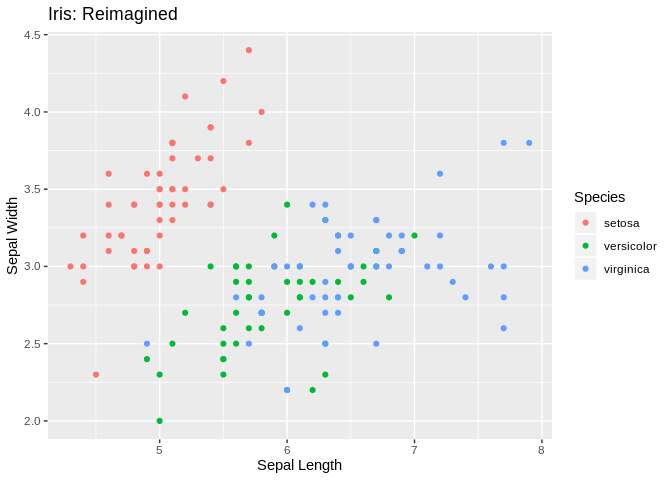
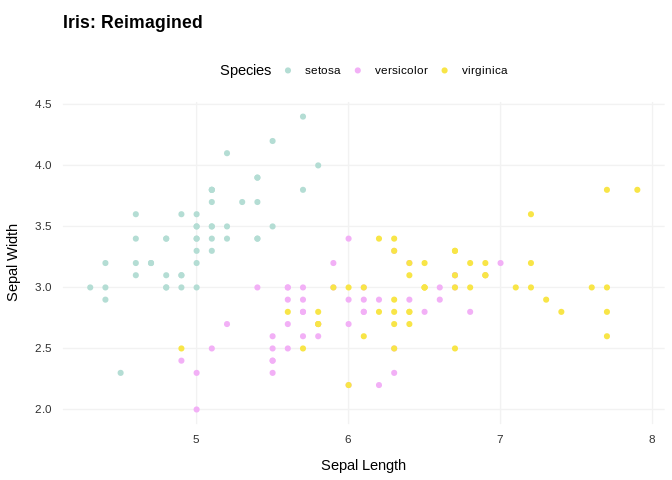
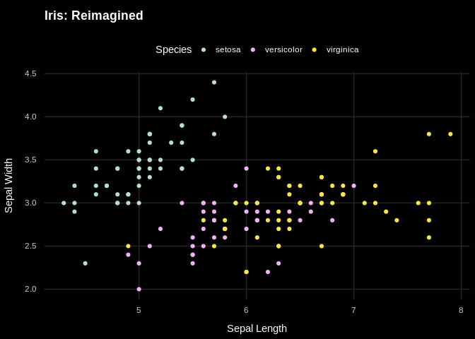

<!-- README.md is generated from README.Rmd. Please edit that file -->

# algothemes

<!-- badges: start -->

[](https://www.tidyverse.org/lifecycle/#experimental)
[](https://travis-ci.org/bagasbgy/algothemes)
<!-- badges: end -->

## Overview

`algothemes` provides some extra theme and scales for visualization with
Algoritma Data Science School theme using
[`ggplot2`](https://ggplot2.tidyverse.org).

## Installation

You can install the development version of `algothemes` with:

``` r
# install.packages("remotes")
remotes::install_github("bagasbgy/algothemes")
```

## Getting started

``` r
# import libs
library(ggplot2)
library(algothemes)

# an example visualization
p <- ggplot(iris, aes(x = Sepal.Length, y = Sepal.Width)) +
  geom_point(aes(colour = Species)) +
  labs(title = "Iris: Reimagined", x = "Sepal Length", y = "Sepal Width")

p
```

<!-- -->

``` r
# with theme algo and light mode
p +
  theme_algo(mode = "light") +
  scale_colour_algo(mode = "light")
```

<!-- -->

``` r
# with theme algo and dark mode
p +
  theme_algo(mode = "dark") +
  scale_colour_algo(mode = "dark")
```

<!-- -->
